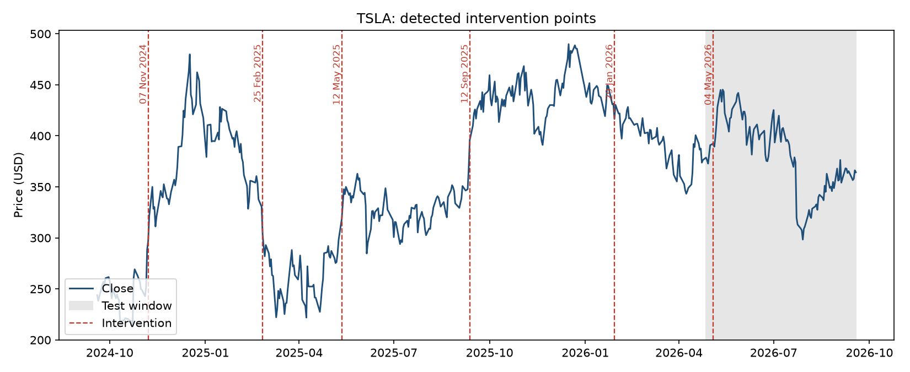
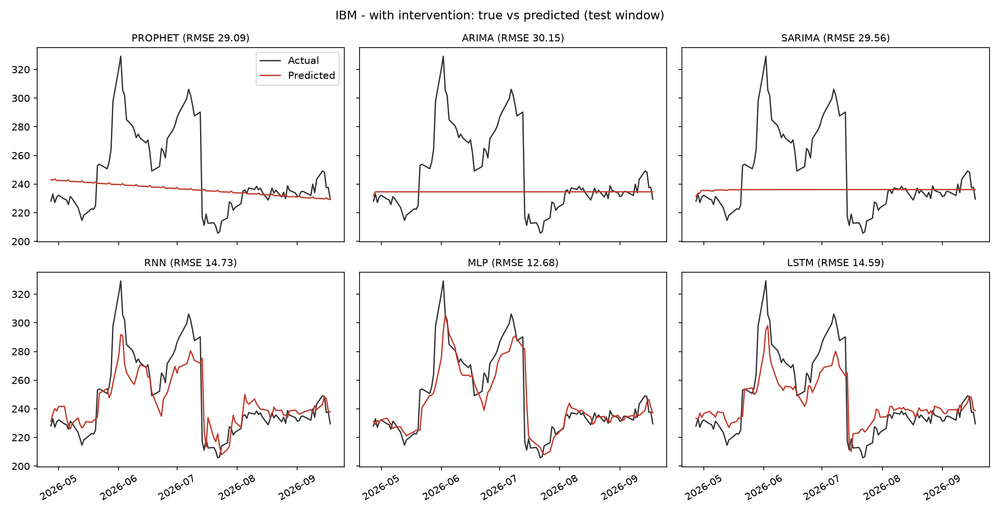

# Intervention Analysis for Stock Price Forecasting

Stock prices change regime abruptly: earnings surprises, product news, macro shocks. A forecaster that only sees
past prices has to relearn the new level after every such event. This project asks a simple question:

> **If we detect these regime shifts ("interventions") and tell the model about them, do forecasts improve, and
> for which kinds of model?**

It detects interventions automatically with a sliding-window change-point search, encodes them as an intervention
variable `D_t`, and compares six forecasters with and without it: three time-series models (ARIMA, SARIMA,
Prophet) and three deep-learning models (RNN, LSTM, MLP). It is run on Tesla (TSLA) and IBM daily closing prices
for the two years ending 2026-09-18.

## How it works

| Step | What happens | Code |
|---|---|---|
| Data | Daily OHLCV + Adj Close from Yahoo Finance, cached locally; chronological 80 / 20 train-test split | [`data.py`](src/intervention_analysis/data.py) |
| Intervention detection | Sliding-window change-point search on an RBF-kernel fit term plus a penalty term, `C_k = F_k + P_k`; the lowest-cost segmentation gives the intervention dates | [`changepoint.py`](src/intervention_analysis/changepoint.py) |
| Intervention variable | One step dummy `D_t` per detected date (`1` from that date on) | [`changepoint.py`](src/intervention_analysis/changepoint.py) |
| Time-series models | ARIMA and SARIMA with `D_t` as an exogenous regressor; Prophet with `D_t` as an extra regressor plus a holiday term | [`models/statistical.py`](src/intervention_analysis/models/statistical.py) |
| Deep models | RNN and LSTM receive `D_t` as an extra input at every step (equivalent to an added `W . D_t` term in the hidden state / gates); the MLP adds `delta . D_t` to its second layer | [`models/deep.py`](src/intervention_analysis/models/deep.py) |
| Evaluation | MSE, RMSE and MAE on the held-out 20 %; true-vs-predicted plots | [`metrics.py`](src/intervention_analysis/metrics.py), [`plots.py`](src/intervention_analysis/plots.py) |

Every model is fitted twice on the same split: **without** intervention terms (baseline) and **with** them.

## Quick start

Python 3.10+ (developed on 3.11).

```bash
python -m venv .venv
source .venv/bin/activate        # Windows: .venv\Scripts\activate
pip install -e ".[dev]"

python -m intervention_analysis --config config.yaml   # or: intervention-analysis
pytest                                                  # unit tests (a few seconds)
```

A full run (2 tickers x 6 models x 2 variants, 3 seeds per network) takes roughly 10 minutes on CPU. Prices are
cached in [`data/`](data), so re-runs are reproducible and offline; add `--refresh` to download the latest prices,
and `--tickers AAPL MSFT` to try other companies. All settings live in [`config.yaml`](config.yaml).

Outputs land in `results/`:

```
results/summary.md            MSE / RMSE / MAE tables
results/metrics.csv           all metrics (deep models also report std over seeds)
results/<TICKER>/interventions.csv|png   detected intervention dates
results/<TICKER>/forecast_{baseline,intervention}.png   true vs predicted, all six models
results/<TICKER>/predictions.csv
```

## Results

Data: 501 trading days (2024-09-19 to 2026-09-18), 400 for training and 101 for testing.

### Detected interventions

* **TSLA**: 2024-11-07, 2025-02-25, 2025-05-12, 2025-09-12, 2026-01-29, 2026-05-04
* **IBM**: 2025-01-30, 2025-07-24, 2025-09-18, 2026-02-11, 2026-07-14

Dates are listed in `results/<TICKER>/interventions.csv` with the price move around each one; the `event` column is
left blank so each date can be annotated with the news behind it. An intervention inside the test window (TSLA
2026-05-04, IBM 2026-07-14) cannot be learned from training data, so it is reported but not used as a regressor.



### Forecast error (RMSE, USD), without -> with intervention terms

Models can be evaluated in two ways, and the choice matters (see the second finding below):

* **Native mode**: ARIMA, SARIMA and Prophet forecast the whole 101-day test window from the end of training;
  the deep networks, which take a window of past prices as input, predict one step ahead from the true past.
* **One-step-ahead**: every model predicts each day from the true past. Prophet and the deep networks are
  unchanged from native mode, so only ARIMA and SARIMA differ.

| Model | TSLA native | IBM native | TSLA one-step | IBM one-step |
|---|---|---|---|---|
| Prophet | 65.31 -> **39.33** | 68.68 -> **29.09** | same | same |
| ARIMA | 37.23 -> 37.12 | 30.77 -> 30.15 | 15.54 -> **12.38** | 10.68 -> 10.83 |
| SARIMA | 37.29 -> 37.14 | 30.55 -> 29.56 | 15.54 -> **12.50** | 10.68 -> 10.77 |
| RNN | 13.56 -> 15.09 | 11.42 -> 15.21 | same | same |
| MLP | 12.64 -> 14.31 | 11.66 -> 12.26 | same | same |
| LSTM | 12.69 -> 14.26 | 10.87 -> 15.30 | same | same |
| *Yesterday's close (naive)* | 12.41 | 10.58 | 12.41 | 10.58 |

Full MSE / RMSE / MAE tables are in [`results/summary.md`](results/summary.md).



### Findings

1. **Intervention terms help the time-series models.** Prophet gains the most (IBM RMSE 68.7 -> 29.1, TSLA
   65.3 -> 39.3): its trend otherwise extrapolates straight through regime shifts, so knowing where the shifts
   are removes most of that error. ARIMA and SARIMA improve modestly, and clearly on TSLA one-step forecasts
   (15.5 -> 12.4).
2. **They do not help the deep models on this much data.** With about 400 training points, the extra inputs add
   more variance than signal, and RNN, LSTM and MLP got slightly worse on both stocks.
3. **The evaluation mode changes the ranking.** Deep networks look roughly 2.5-3x better than ARIMA in native mode (RMSE ~11-15 vs 30-37), but
   only because they see the true price at every step while ARIMA forecasts about 100 days blind. Compared
   one-step-ahead, ARIMA and SARIMA are on par with or better than the deep networks. Comparisons between model
   families are only meaningful within the same mode.
4. **No model clearly beats "yesterday's price".** The naive forecast scores 12.41 (TSLA) and 10.58 (IBM); the
   best models sit between 10.7 and 12.4. That is typical of a near random-walk price series, and it means the
   forecasts here are not a trading signal.

### Limitations

* One train/test split per ticker and two stocks: treat RMSE differences of a few tenths as noise.
* Detection runs on the whole series, then only interventions inside the training window are used as regressors.
  The intervention is treated as a known event at forecast time (its future value is given to the model), which
  is realistic for scheduled events such as earnings but not for surprises.
* Early stopping was tried for the deep networks and stopped the MLP / LSTM before they had fit the data, so it is
  off by default (300 epochs). That choice was made after looking at IBM test errors, so IBM's deep-model numbers
  are slightly optimistic.
* Research code, not investment advice.

## Modelling choices

All configurable in [`config.yaml`](config.yaml).

* **Intervention variable.** A step dummy per detected date (`kind: pulse` gives a one-day shock instead). With
  several interventions, each gets its own column and `delta` is a vector.
* **Detection.** `ruptures.Window` with the RBF cost; the number of interventions is controlled by the penalty
  (`pen`) or fixed with `n_bkps`. Window width and kernel bandwidth are also configurable.
* **ARIMA / SARIMA.** The `(p, 1, q)` order is chosen by AIC on the training set and shared by both models;
  SARIMA adds a weekly seasonal `(1, 0, 1, 5)`. No constant is used because of the differencing.
* **Deep models.** Prices are min-max scaled using training data only; 20-day look-back; Adam; each network is
  trained with 3 seeds and metrics are averaged (per-seed spread is in `metrics.csv`). The MLP output layer is
  linear, since a sigmoid head would cap forecasts at the training maximum. The intervention variable is aligned
  with the day being predicted, the same way the exogenous regressor is used by ARIMA / SARIMA.
* **Target.** The daily `Close` price.

## Project layout

```
config.yaml            all settings
data/                  cached prices (TSLA.csv, IBM.csv)
results/               tables and figures produced by the last run
src/intervention_analysis/
    data.py  changepoint.py  metrics.py  pipeline.py  plots.py  __main__.py
    models/  base.py  statistical.py  deep.py
tests/                 unit tests
```

## Authors

Krish Valecha, Yash Pandloskar, Sowmya Dadheech, Pradnya Saval — Dwarkadas J. Sanghvi College of Engineering,
Mumbai.
